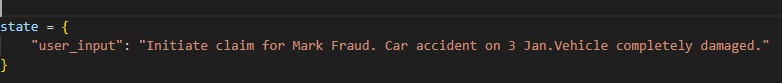

1. Requires Python Version - 3.11
2. Create virtual environment - Ctrl + Shift + P - Python -> Create Environment
3. Activate the virtual environment - venv\Scripts\activate
4. Install the dependencies - pip install langchain langchain-community langgraph chromadb streamlit mcp pydantic ollama

Then, build the RAG context by running the command: python rag/ingest.py

To run it through console:
1. main.py has a 'user_input' to give user prompts. 

2. Use the below prompts in the user_input in main.py
a. Genuine - Initiate claim for John Doe. Car accident on 5 Jan. Front bumper damaged.
b. Fraud - Initiate claim for Mark Fraud. Car accident on 3 Jan.Vehicle completely damaged.
3. Run the command - python main.py
4. Agents will run and give the decision in the end.

To run it through UI:
1. Run the command - streamlit run ui/app.py
2. UI will open in the browser.
3. Give the prompt as mentioned above and click on Submit Claim button
4. After some time, decision will be displayed on UI

Note: Only for the fraud prompt, to simulate human-in-the-loop functionality, a prompt will come in the console,
'Is this a legitimate claim ?', need to enter N for the same, and then the flow will continue.

Make sure the Ollama 'qwen' model server is running while testing

